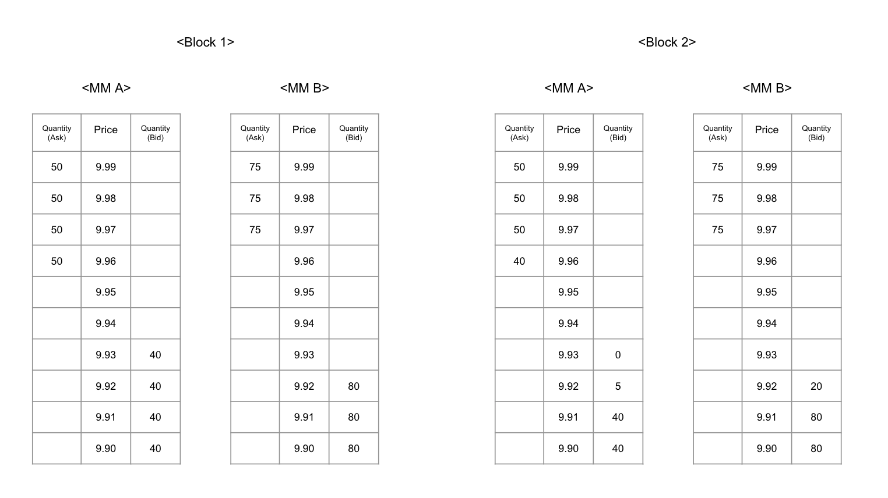

## Abstract

This program is for off-chain evaluation of market maker performance from on-chain data stored in Crescent Network

# Concepts

## Spread

Spread(or Bid-ask spread) measures the distance of 2-sided liquidity provided by market maker. Spread is price difference between lowest ask and highest bid (average price of bid and ask).

## Depth

Market depth is the quantity of bids and asks placed on an order book by market maker. If market depth is not enough to handle large amount of trade, market liquidity is insufficient despite its narrow spread.

## Uptime

Uptime measure the availability of the liquidity. Uptime is calculated as percentage of time a market maker provided orders which satisfy certain conditions.

## Market Maker Order Type

Market makers are provided a special order type so that they can place and cancel multiple market making orders by single transaction. Market maker order type supports to place the order amount into maximum 10 separate limit orders. This specific order type allows market makers atomic placement of group of limit orders, minimizing broadcasting failures and burdens.

# Scoring

## Methodology

- Market maker score is calculated for each month.
- The calculation is done off-chain based on on-chain blockchain data. Codebase is publicly available for any third party verification.

## Formula

- Following formula is used to compute how much incentives should be rewarded to each market maker per month. The amount of CRE earned is determined by the relative share of each market maker’s score.
1. First step (within a block)
    - Calculate 2-sided contribution score and take minimum value

      $C = min \lbrack{ {AskQ1}\over{AskD1^2} }+ { {AskQ2}\over{AskD2^2} } + ... , { {BidQ1}\over{BidD1^2} }+ { {BidQ2}\over{BidD2^2} } + ... \rbrack$

       - `AskQ(n)`, `BidQ(n)` : Number of token remaining (after trade) in n-th tick
       - `AskD(n)`, `BidD(n)` : Price difference of n-th tick and mid-price divide with mid-price
       - Calculate C when the market maker order satisfy `MaxSpread`, `MinWidth`, `MinDepth` conditions. If the order doesn’t satisfy these conditions, C is 0.
2. Second step (within a block)
    - Calculate each market maker’s contribution score and obtain proportion of it $C_m \over \sum_i C_i$

3. Third step (within a month)
    - Calculate `Uptime` within a month
        - Obtain `LiveHour`
            - `LiveHour` is added as market maker provide valid liquidity for each hour
            - Following 1 out of 2 conditions, hour obligation failed
                - No valid orders longer than `MaxDowntime` in a row
                - No valid orders longer than `MaxTotalDowntime` total in an hour
        - `Uptime` is calculated as follows : U = Total `LiveHour` / Total hours in a month
4. Forth step (Final score)
    - Final score of market maker “m” is as following :

$$
S_m = {U_m} ^3 \sum_{t=1}^{B} \lbrack { C_{mt} \over \sum_i C_{it} }\rbrack
$$

- $U_m$ is % of Market maker m’s `Uptime` in the month
- $B$  is total number of blocks for the month
- $C_{mt}$ is contribution score of market maker “m” at block “t”

## Processing Order data

- All variables are used as final values after the trade is done. In case order of m-th tick is partially filled, the tick can be a reference point(whether highest bid or lowest ask) of measures when one of following conditions is met. If not, those measures should be calculated in next (not-traded) tick, and tick is fall out in calculating the sum of depth.
    - `AskQ(m)`/`BidQ(m)` is larger than `MinOpenRatio` of the original order amount of the tick
    - `AskQ(m)`/`BidQ(m)` is larger than `MinOpenDepthRatio` of `MinDepth`

## Breadth of Liquidity

- Basic Measure
    - `MidPrice` is average price of lowest ask and highest bid
    - `Spread` is price difference between lowest ask and highest bid divide by `MidPrice`
    - `AskWidth` is price difference between highest ask and lowest ask divided by `MidPrice`, `BidWidth` is same with bid prices
    - `AskD(n)` is price difference between `MidPrice` and n-th ask price divided by `MidPrice`, `BidD(n)` is same with bid prices
    - The variables calculate at precision 3
- Example

  

  Initial order is intact in Block1 and partially filled in next block. Let’s calculate breaths each :

    - Block1
        - `MidPrice` : 9.945 = (9.96+9.93) / 2
        - `Spread` : 0.0030.. = (9.96-9.93) / 9.945
        - `AskWidth` : 0.0030.. = (9.99-9.96) / 9.945
        - `BidWidth` : 0.0030.. = (9.93-9.90) / 9.945
        - `AskD(1)` : 0.0015.. = (9.96-9.945) / 9.945

          `AskD(2)` : 0.0025.. = (9.97-9.945) / 9.945

          `AskD(3)` : 0.0035.. = (9.98-9.945) / 9.945

          `AskD(4)` : 0.0045.. = (9.99-9.945) / 9.945

          `BidD(1)` : 0.0015.. = (9.945-9.93) / 9.945

          `BidD(2)` : 0.0025.. = (9.945-9.92) / 9.945

          `BidD(3)` : 0.0035.. = (9.945-9.91) / 9.945

          `BidD(4)` : 0.0045.. = (9.945-9.90) / 9.945

    - Block2
        - Lowest ask order of 9.96 is valid reference point because `AskQ(1)` is 80% of its original order, which is larger than `MinOpenRatio` of 50%.
        - Highest bid order of 9.92 is not valid reference point because `BidQ(2)` is not as large as `MinOpenRatio` of original order nor `MinOpenDepthRatio` of `MinDepth`. Therefore highest bid price is 9.91 at this time.
        - `MidPrice` : 9.935 = (9.96+9.91) / 2
        - `Spread` : 0.0050.. = (9.96-9.91) / 9.935
        - `AskWidth` : 0.0030.. = (9.99-9.96) / 9.935
        - `BidWidth` : 0.0010.. = (9.91-9.90) / 9.935
        - `AskD(1)` : 0.0025.. = (9.96-9.935) / 9.935

          `AskD(2)` : 0.0035.. = (9.97-9.935) / 9.935

          `AskD(3)` : 0.0045.. = (9.98-9.935) / 9.935

          `AskD(4)` : 0.0055.. = (9.99-9.935) / 9.935

          `BidD(3)` : 0.0025.. = (9.935-9.91) / 9.935

          `BidD(4)` : 0.0035.. = (9.935-9.90) / 9.935

## Depth(Quantity)

- Basic Measure
    - `AskQ(n)`/`BidQ(n)` is the number of token remaining in n-th tick
    - `AskDepth`/`BidDepth` is total number of token remaining in ask/bid side
- Example

  Same example from above :

    - Block1
        - `AskDepth` : 200
        - `AskQ(1)`~`AskQ(4)` : 50
        - `BidDepth` : 160
        - `BidQ(1)`~`BidQ(4)` : 40
    - Block2
        - Lowest ask order of 9.96 is valid, while highest bid order of 9.92 is not valid. We neglect `BidQ(2)` from calculating `BidDepth`
        - `AskDepth` : 190
        - `AskQ(1)` : 40
        - `AskQ(2)`~`AskQ(4)` : 50
        - `BidDepth` : 80
        - `BidQ(1)`~`BidQ(2)` : 0
        - `BidQ(3)`~`BidQ(4)` : 40

## Requirements of Market Making Orders

- Market makers should provide liquidity in specific manner(using Market-maker order type) in order to be recognized and evaluated
- Orders satisfying following conditions only can obtain contribution scores, unless it will get 0 point in the block :
    - `Spread` narrower than `MaxSpread` to ensure transaction cost to be as low as possible for traders
    - Order `Width` of both side wider than `MinWidth` for quality liquidity in the market
    - `Depth` larger than `MinDepth` in order to provide meaningful market depth to users
- These parameters are assigned differently for each pair depending on the market characteristics, and can be adjusted by governance
- Example

  Assume `MaxSpread` 0.012, `MinWidth` 0.002, `MinDepth` 100 with same example above :

    - Block1
        - All the condition is met
            - Spread (0.0030..) < MaxSpread (0.012)
            - AskWidth(0.0030..), BidWidth(0.0030..) > MinWidth (0.002)
            - AskDepth(200), BidDepth(160) > MinDepth (100)
        - Contribution Score is as follows,

          $C = min \lbrack{ {AskQ1}\over{AskD1^2} }+ { {AskQ2}\over{AskD2^2} } + ... , { {BidQ1}\over{BidD1^2} }+ { {BidQ2}\over{BidD2^2} } + ... \rbrack$

          $C = min \lbrack{ {50}\over{0.0015..^2} }+ {{50}\over{0.0025..^2} } + {{50}\over{0.0035..^2} }+ {{50}\over{0.0045..^2} }, {{40}\over{0.0015..^2} }+ {{40}\over{0.0025..^2} } + {{40}\over{0.0035..^2}}+ {{40}\over{0.0035..^2} }\rbrack$

          $C = min \lbrack36369600.., 29095680..\rbrack = 29,095,680..$

    - Block2
        - Bid side failed to meet the requirement,
            - Spread (0.0050..) < MaxSpread (0.012)
            - AskWidth(0.0030..) > MinWidth (0.002)
            - `BidWidth(0.0010..) < MinWidth (0.002)`
            - AskDepth(190) > MinDepth (100)
            - `BidDepth(80) < MinDepth (100)`
        - Because it failed to meet the minimum requirement of market maker order, the contribution score is 0 in Block 2

## Market Maker Eligibility

- Market maker applicants who achieve minimum requirement of uptime obtain eligibility. Requirements of uptime has 3 levels.
    - Hourly obligation : `LiveHour` is added as market maker provide valid liquidity for an hour
    - Daily obligation : `LiveDay` is added as `LiveHour` is larger than `MinHours` in a day
    - Monthly obligation : `LiveDay` larger than `MinDays` complete the requirements
- New applicants should meet monthly obligation and submit ApplyMarketMaker transaction to obtain eligibility in market maker incentives. Existing market makers are obliged to fulfill uptime conditions to maintain their eligibility. Market makers who fail to meet the requirements for 2 consecutive months or 3 months within the last 5 months can be excluded by governance.
- Existing market makers who fail to meet the conditions can be given this month’s incentives according to the scores they earned.

## Parameters

Scoring module contains following parameters :

### Common Parameters

| Key               | Definition                                          | Example      |
|-------------------|-----------------------------------------------------|--------------|
| MinOpenRatio      | Minimum ratio to maintain the tick order            | 0.5          |
| MinOpenDepthRatio | Minimum ratio of open amount to MinDepth            | 0.1          |
| MaxDowntime       | Maximum allowable consecutive blocks of outage      | 20 (blocks)  |
| MaxTotalDowntime  | Maximum allowable sum of blocks in an hour          | 100 (blocks) |
| MinHours          | Minimum value of LiveHour to achieve LiveDay        | 16           |
| MinDays           | Minimum value of LiveDay to maintain MM eligibility | 22           |

### Parameters for each pair

| Key             | Definition                                                                | Example                                                        |
|-----------------|---------------------------------------------------------------------------|----------------------------------------------------------------|
| PairId          | Pair id of liquidity module                                               | 20                                                             |
| UpdateTime      | Time the pair variables start to be applied to the scoring system         | 2022-12-01T00:00:00Z                                           |
| IncentiveWeight | Incentive weights for each pair                                           | 0.1                                                            |
| MaxSpread       | Maximum allowable spread between bid and ask                              | 0.006 (ETH-USDC pair), 0.012 (ATOM-USDC pair)                  |
| MinWidth        | Minimum allowable price difference of high and low on both side of orders | 0.001 (ETH-USDC pair), 0.002 (ATOM-USDC pair)                  |
| MinDepth        | Minimum allowable order depth on each side                                | 600000000000000000 (ETH-USDC pair), 100000000 (ATOM-USDC pair) |
